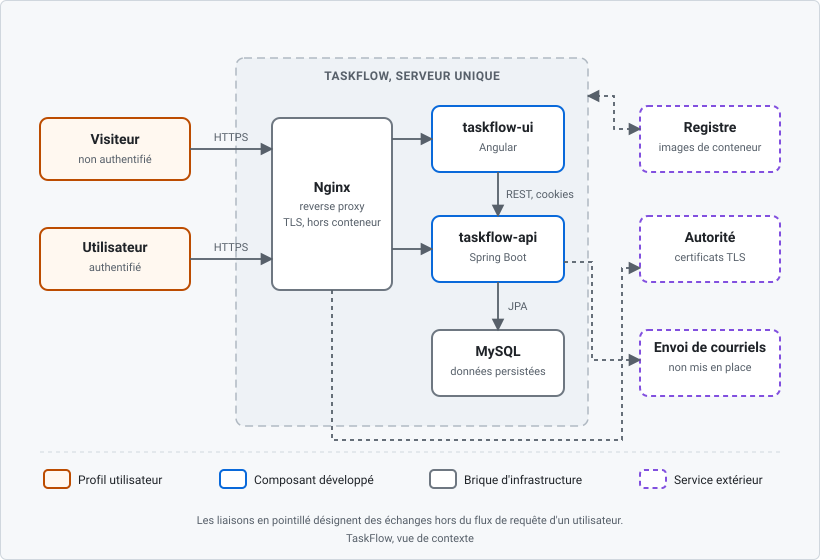
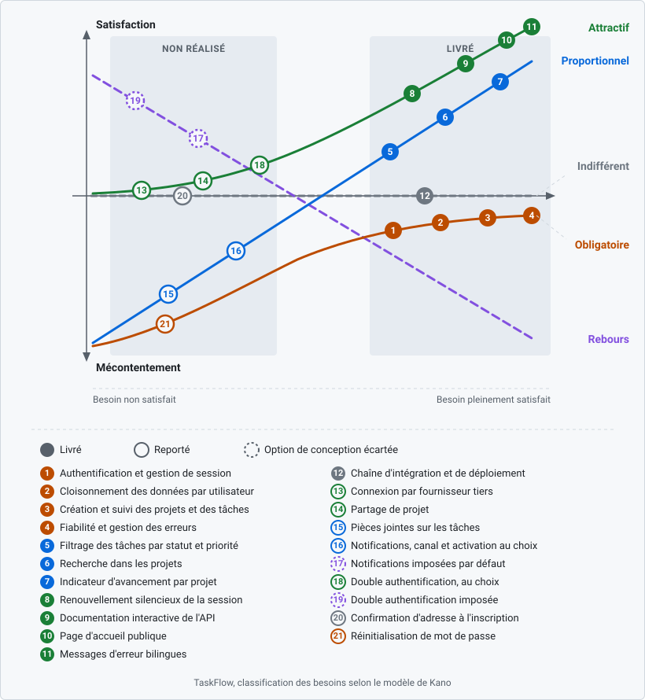

# TaskFlow, expression des besoins

> Document de cadrage et d'expression des besoins du portfolio TaskFlow.
> Emplacement : `taskflow-deploy/docs/01-expression-des-besoins/EXPRESSION_DES_BESOINS.md`
> Rédigé en français. Dernière mise à jour : 7 août 2026.

Ce document couvre les trois dépôts du portfolio :
[taskflow-api](https://github.com/mehdi-rochereau/taskflow-api),
[taskflow-ui](https://github.com/mehdi-rochereau/taskflow-ui) et
[taskflow-deploy](https://github.com/mehdi-rochereau/taskflow-deploy).

Il s'ouvre par un tableau de cadrage et se ferme par une priorisation des besoins.
Entre les deux se tient le document de vision proprement dit, en sept sections.

---

## Sommaire

- [Cadrage](#cadrage)
- [1. Introduction](#1-introduction)
- [2. Positionnement](#2-positionnement)
- [3. Parties prenantes et utilisateurs](#3-parties-prenantes-et-utilisateurs)
- [4. Fonctionnalités essentielles](#4-fonctionnalités-essentielles)
- [5. Périmètre](#5-périmètre)
- [6. Contraintes](#6-contraintes)
- [7. Autres exigences](#7-autres-exigences)
- [Priorisation des besoins](#priorisation-des-besoins)

---

## Cadrage

| Question | Réponse |
|----------|---------|
| **Quoi** | Une application web de gestion de projets et de tâches, composée d'une API REST, d'une interface web et d'une pile de déploiement conteneurisée. |
| **Pourquoi** | Démontrer les compétences du titre professionnel Concepteur développeur d'applications sur un projet complet, de la conception au déploiement continu, et servir de support d'entretien pour une alternance. |
| **Qui** | Un développeur unique, qui cumule la maîtrise d'ouvrage et la maîtrise d'œuvre. Les utilisateurs cibles sont fictifs et le produit n'a pas de commanditaire externe. |
| **Où** | Développement en local, production sur un serveur virtuel privé situé en Allemagne, avec nom de domaine, HTTPS et pare-feu. Code et gouvernance publics sur GitHub. |
| **Quand** | De mars à août 2026, en huit phases de durée variable, dont deux interruptions assumées et documentées. |
| **Comment** | Trois dépôts Git pilotés depuis un GitHub Project unique, intégration et déploiement continus, conteneurs Docker derrière un reverse proxy. |
| **Combien** | Aucun budget de développement. Deux coûts récurrents seulement : l'hébergement, environ 10 € par mois, serveur, sauvegardes et adresse IP comprises, et le nom de domaine, 12,59 € par an. Soit environ 130 € par an. La ressource réellement contrainte est le temps, pas l'argent. |

La ligne « Qui » est la plus importante du tableau. Elle pose dès l'ouverture que
maîtrise d'ouvrage et maîtrise d'œuvre sont confondues, ce qui explique l'absence de
comptes rendus de réunion, de matrice de responsabilités et de validation externe dans
le reste du dossier. Ce n'est pas un oubli, c'est une conséquence de la structure du
projet.

---

## 1. Introduction

### 1.1 Objet du document

Ce document décrit ce que TaskFlow doit faire, pour qui, dans quelles limites et sous
quelles contraintes. Il ne décrit ni l'architecture technique, ni les modèles de
données, ni les procédures de déploiement, qui relèvent des sections suivantes de la
documentation.

### 1.2 Portée

La portée couvre l'ensemble du produit livré, c'est-à-dire l'API REST, l'interface web
et l'infrastructure de déploiement. Elle ne couvre pas la gouvernance du projet, qui
fait l'objet d'un document distinct.

### 1.3 Définitions

| Terme | Définition retenue dans ce document |
|-------|--------------------------------------|
| **Projet** | Conteneur nommé appartenant à un utilisateur unique, regroupant des tâches. |
| **Tâche** | Unité de travail appartenant à un projet, portant un statut et une priorité. |
| **Utilisateur authentifié** | Personne disposant d'un compte et d'une session valide, propriétaire exclusif de ses projets. |
| **Visiteur** | Personne non authentifiée, qui n'accède qu'aux pages publiques. |
| **Cloisonnement** | Règle selon laquelle un utilisateur n'accède qu'à ses propres ressources, appliquée côté serveur et non côté interface. |
| **Session** | Couple formé d'un jeton d'accès de courte durée et d'un jeton de rafraîchissement, tous deux portés par des cookies inaccessibles au JavaScript. |
| **Rôle global** | Droit attaché au compte et portant sur l'application entière, par exemple un administrateur voyant tous les comptes. Aucun n'existe dans TaskFlow. |
| **Droit sur ressource** | Droit attaché au couple utilisateur-projet, vérifié à chaque accès. Aujourd'hui réduit à la propriété exclusive. |
| **Adresse électronique** | Donnée obligatoire à l'inscription. Aujourd'hui utilisée uniquement comme identifiant de connexion alternatif au nom d'utilisateur. Le produit n'envoie aucun courriel. |

### 1.4 Vue d'ensemble du produit

Avant d'énumérer ce que TaskFlow fait, il faut savoir de quoi il est fait. Trois
composants développés, deux briques d'infrastructure, un seul serveur, et des services
extérieurs sur lesquels le produit s'appuie sans les maîtriser.

Trois choses se lisent sur cette figure et éclairent tout le reste du document. Le
**reverse proxy est le seul point d'entrée** : aucun composant applicatif n'est
joignable directement depuis l'extérieur, ce qui est la première couche de la sécurité
décrite en 7.4. **L'interface ne touche jamais la base de données**, elle passe
systématiquement par l'API, ce qui explique que le cloisonnement des données soit
contrôlé côté serveur et non masqué côté interface. Et le **service d'envoi de
courriels est représenté alors qu'il n'existe pas** : il figure ici parce qu'il est la
dépendance qu'appelleraient les besoins reportés de la section 5.2, et sa place sur la
figure rend visible ce que ces besoins coûteraient.

Cette vue reste volontairement grossière. Le détail des couches, des interfaces et des
flux d'authentification relève de la section de conception, pas de l'expression des
besoins.

### 1.5 Références

Les fonctionnalités énumérées dans ce document sont celles réellement livrées et
documentées dans les fichiers `README` des trois dépôts. Les mesures de sécurité sont
détaillées dans les fichiers `SECURITY` de chaque dépôt. Les conventions de travail,
le cycle de vie des tâches et la traçabilité des livraisons sont décrits dans
`02-gestion-de-projet/PROJECT_MANAGEMENT.md`.

---

## 2. Positionnement

### 2.1 Problème traité

Organiser un travail personnel réparti en projets est un besoin banal, et les outils
existants sont nombreux. Le problème traité n'est donc pas l'absence d'outil, c'est la
combinaison de trois exigences que peu d'outils gratuits satisfont ensemble : une
isolation stricte des données par utilisateur, une interface légère qui reste
utilisable sur mobile, et une API documentée qu'un tiers puisse consommer sans lire le
code.

Le problème réellement adressé par le projet est double, et il faut le dire pour que
la suite du dossier se tienne. Sur le plan du produit, il s'agit de fournir un outil de
suivi de tâches sobre et cloisonné. Sur le plan du portfolio, il s'agit de produire un
objet vérifiable, déployé et documenté, qui atteste de compétences plutôt que de les
affirmer.

### 2.2 Énoncé de position du produit

Pour un utilisateur qui veut suivre ses tâches par projet sans créer de compte chez un
éditeur ni installer de logiciel, TaskFlow est une application web accessible depuis un
navigateur, qui offre la création de projets, la gestion des tâches par statut et par
priorité, et une isolation complète des données entre comptes.

Contrairement aux suites de gestion de projet généralistes, qui imposent une notion
d'organisation, d'équipe et de rôles avant de pouvoir créer la première tâche, TaskFlow
assume un modèle strictement individuel et n'expose que ce qui sert à ce modèle.

### 2.3 Objectifs

Trois objectifs, formulés selon le cadre SMARTE : spécifique, mesurable, atteignable,
réaliste, temporellement défini, et écologique ou éthique.

**Objectif 1, fonctionnel.** Livrer en production une application de gestion de projets
et de tâches couvrant l'inscription, l'authentification, le cloisonnement des données
et les opérations de création, consultation, modification et suppression sur les
projets comme sur les tâches.

| Critère | Application |
|---------|-------------|
| Spécifique | Périmètre nommé fonctionnalité par fonctionnalité en section 4, avec ses limites en section 5. |
| Mesurable | Couverture des tests automatisés de l'API supérieure à 80 %, chaîne d'intégration verte, application accessible publiquement sous HTTPS. |
| Atteignable | Périmètre volontairement réduit à un modèle mono-utilisateur, sans partage ni collaboration. |
| Réaliste | Technologies choisies parmi celles déjà pratiquées en formation, sur une base de données relationnelle classique. |
| Temporel | Mise en ligne de la version 1.0.0 avant fin mai 2026. |
| Éthique et écologique | Aucune collecte de données au-delà de ce que le service exige, aucun traceur publicitaire, aucun service tiers d'analyse d'audience. |

**Objectif 2, démonstration de compétence.** Produire, pour chaque compétence du titre
visé, un artefact public et vérifiable, plutôt qu'une déclaration.

| Critère | Application |
|---------|-------------|
| Spécifique | Une section de documentation numérotée par domaine de compétence, une issue par section, une trace de gestion par unité de travail. |
| Mesurable | Chaque section publiée est atteignable depuis le sommaire de la documentation, et chaque unité de travail est reliée à une issue, une branche et une demande de fusion. |
| Atteignable | La matière existe déjà, il s'agit de la formaliser et non de la produire. |
| Réaliste | Documentation portée par le dépôt de déploiement, sans outil externe à maintenir. |
| Temporel | Documentation complète avant la session d'examen de novembre 2026. |
| Éthique | Aucun artefact reconstitué ne se présente comme antérieur au travail qu'il décrit. Les reconstitutions sont signalées comme telles. |

**Objectif 3, exploitation.** Maintenir l'application en ligne, sous HTTPS, avec un
déploiement automatisé et reproductible.

| Critère | Application |
|---------|-------------|
| Spécifique | Conteneurs publiés dans un registre, déploiement déclenché par la fusion sur la branche principale, certificat renouvelé automatiquement. |
| Mesurable | Aucun accès en clair, aucun port applicatif joignable depuis l'extérieur en dehors du reverse proxy, chaîne de déploiement fonctionnelle sur chaque livraison. |
| Atteignable | Un seul serveur, trois services conteneurisés, une configuration unique. |
| Réaliste | Coût total d'environ 130 € par an, hébergement et nom de domaine compris, compatible avec un budget personnel. |
| Temporel | Chaîne de déploiement opérationnelle depuis mai 2026, maintenue jusqu'à la soutenance. |
| Écologique | Mutualisation des trois services sur une seule machine plutôt qu'un serveur par composant, images de base minimales, aucune redondance sans usage. |

### 2.4 Une précision d'honnêteté

Ces objectifs sont formulés sur un produit déjà livré. Aucun document d'objectifs daté
n'a précédé le développement, qui a commencé sans formalisation préalable. Le présent
document est donc une reconstruction, faite à partir du travail réellement accompli et
des décisions réellement prises, et non un cahier des charges rétro-daté.

Le choix de l'écrire plutôt que de le taire est délibéré. Un document de vision daté de
mars 2026 qui décrirait exactement ce qui a été livré en août serait invérifiable et
suspect. La formalisation prévisionnelle réelle, celle qui précède le travail, est
apportée par ailleurs dans le dossier.

---

## 3. Parties prenantes et utilisateurs

### 3.1 Parties prenantes

| Partie prenante | Rôle | Attente principale |
|-----------------|------|--------------------|
| Développeur | Maîtrise d'ouvrage et maîtrise d'œuvre confondues | Un produit livré et une trace exploitable du travail |
| Jury de certification | Évaluateur | Des preuves vérifiables couvrant les compétences du titre |
| Recruteur ou entreprise d'accueil | Lecteur | Une démonstration de savoir-faire technique et méthodologique |
| Hébergeur | Fournisseur | Aucune, hors respect des conditions d'usage |

Il n'y a **ni commanditaire externe, ni comité de pilotage, ni utilisateur métier à
consulter**. Aucune décision de périmètre n'a été arbitrée par un tiers. Inventer un
client fictif aurait produit des comptes rendus de réunion faux ; la conséquence
assumée est que les artefacts de coordination d'équipe sont absents de ce projet et
apportés par une autre expérience du dossier.

### 3.2 Profils utilisateurs

| Profil | Accès | Besoins |
|--------|-------|---------|
| **Visiteur** | Page d'accueil publique, documentation de l'API, formulaires d'inscription et de connexion | Comprendre à quoi sert le produit et créer un compte sans friction |
| **Utilisateur authentifié** | Ensemble des fonctionnalités, restreint à ses propres données | Créer et suivre ses projets et ses tâches, retrouver rapidement une tâche, garder sa session ouverte sans se reconnecter à chaque visite |

Deux profils suffisent, et il faut résister à la tentation d'en ajouter. Le produit ne
comporte ni rôle global, ni gestion d'équipe, ni délégation. Un troisième profil ne
correspondrait à aucun droit réellement implémenté.

---

## 4. Fonctionnalités essentielles

### 4.1 Compte et session

Inscription avec nom d'utilisateur, adresse électronique et mot de passe, les trois
obligatoires. Connexion indifféremment par le nom d'utilisateur ou par l'adresse.
**L'adresse n'a aujourd'hui aucun autre usage** : elle n'est ni vérifiée, ni utilisée
pour communiquer, le produit n'envoyant aucun courriel. Session
portée par un jeton d'accès de quinze minutes et un jeton de rafraîchissement de sept
jours, tous deux transportés par des cookies inaccessibles au JavaScript. Rotation à
usage unique du jeton de rafraîchissement. Renouvellement silencieux du jeton d'accès,
sans interruption de la navigation ni reconnexion visible. Restauration de la session au
rechargement de la page. Purge planifiée des jetons expirés ou révoqués.

### 4.2 Gestion des projets

Création, consultation, modification et suppression de projets. Recherche en temps réel
dans la liste des projets. Indicateur d'avancement par projet, calculé sur la proportion
de tâches terminées. Confirmation explicite avant toute suppression.

### 4.3 Gestion des tâches

Création, consultation, modification et suppression de tâches rattachées à un projet.
Statut et priorité sur chaque tâche. Filtrage par statut et par priorité, avec
conservation du filtre dans l'adresse de la page, ce qui rend une vue filtrée partageable
et rejouable. États vides distincts selon qu'un projet ne contient aucune tâche ou
qu'un filtre ne renvoie aucun résultat.

### 4.4 Sécurité applicative

Cloisonnement des données par propriétaire, contrôlé côté serveur sur chaque opération
et non seulement masqué dans l'interface. Assainissement des entrées contre l'injection
de contenu actif. Limitation du débit sur les points d'authentification. Journalisation
des événements de sécurité. Réponses d'erreur structurées et uniformes, en anglais et en
français.

### 4.5 Documentation et découverte

Page d'accueil publique présentant le produit et sa pile technique. Documentation
interactive de l'API, exposée par l'API elle-même et intégrée dans l'interface sous une
forme de lecture.

### 4.6 Exploitation

Publication des images de conteneur dans un registre. Déploiement déclenché par la
fusion sur la branche principale. Diffusion derrière un reverse proxy avec certificat
TLS renouvelé automatiquement. Ports applicatifs non exposés directement sur le réseau
public.

---

## 5. Périmètre

Cette section est la plus utile du document, et elle distingue deux choses que le mot
« hors périmètre » confondrait. Ce qui est **exclu**, et le restera, parce que l'inclure
changerait la nature du produit. Et ce qui est **reporté**, souhaité mais non réalisé,
faute de temps et non par choix de conception. Les premières disent qu'on sait refuser,
les secondes qu'on pense le produit au-delà de sa première version.

### 5.1 Exclusions assumées

| Exclusion | Raison |
|-----------|--------|
| Rôles globaux et administration de l'application | Aucun besoin réel sur un produit où chacun n'administre que ses propres données. Un administrateur voyant tous les comptes serait décoratif et créerait un risque sans contrepartie. **Cette exclusion ne porte pas sur les droits attachés à un projet partagé**, qui relèvent de la section 5.2. |
| Collaboration en temps réel | Impose une architecture événementielle et une gestion de conflits sans commune mesure avec le reste du produit. Le partage de projet, lui, n'en a pas besoin : une politique de concurrence suffit. |
| Application mobile native | L'interface est responsive, ce qui couvre l'usage mobile. Une application native serait un second produit. |
| Environnement de préproduction | Un seul serveur, et un environnement supplémentaire n'aurait pas été maintenu. L'absence est compensée par une étape de vérification en production explicitement inscrite dans le cycle de vie des tâches. |
| Traduction complète de l'interface | Seuls les messages d'erreur sont bilingues. Traduire l'ensemble aurait demandé une infrastructure de traduction pour un bénéfice nul sur un produit à utilisateur unique. |

### 5.2 Besoins reportés

| Besoin reporté | Raison du report et conséquences |
|----------------|----------------------------------|
| **Réinitialisation de mot de passe** | **Absente, et c'est le manque le plus sérieux du produit.** Un utilisateur ayant oublié son mot de passe perd l'accès à son compte et à ses données, sans recours. Contrairement aux autres lignes de cette section, il ne s'agit pas d'un confort différé mais d'un besoin obligatoire non satisfait. Impose l'envoi de courriels, avec un jeton à usage unique et à durée courte. |
| Connexion par fournisseur tiers | Préparée en base de données, non finie. Le protocole envisagé est OAuth2, éventuellement via OpenID Connect, mais ce document ne fige pas ce choix : d'autres mécanismes existent, du lien à usage unique aux clés d'accès. |
| Partage de projet | Reporté parce qu'il change le modèle de droits, non parce qu'il est indésirable. Impose une appartenance distincte de la propriété, au moins deux niveaux de droit, un circuit d'invitation vers une personne qui n'a peut-être pas de compte, des règles de cascade à la suppression, et une politique de concurrence entre deux membres modifiant la même tâche. |
| Pièces jointes sur les tâches | Impliquerait un stockage, une politique de quota et une analyse antivirale. Reporté jusqu'à ce que ces trois points soient traités sérieusement. |
| Notifications et rappels | Utiles surtout une fois le partage livré : sur un outil strictement personnel, leur intérêt est faible. Deux canaux envisagés, courriel et notification dans l'application, **avec activation et choix du canal laissés à l'utilisateur**. |
| Double authentification | Deux facteurs additionnels possibles, le mot de passe à usage unique d'une application d'authentification, ou un code envoyé par courriel. Le premier est plus robuste, le second repose sur la sécurité de la boîte de réception de l'utilisateur mais devient peu coûteux dès lors que l'envoi de courriels existe pour d'autres usages. Le choix n'est pas tranché. Dans les deux cas, proposée en option et jamais imposée. |
| Confirmation d'adresse à l'inscription | Sans objet tant qu'aucun courriel n'est envoyé. Devient un préalable dès que les notifications, les invitations ou la récupération de compte existent. |

**Ces sept besoins ne portent aucun numéro de version.** Les annoncer sous une étiquette
`v1.1.0` créerait un engagement que rien ne tient.

---

## 6. Contraintes

### 6.1 Contraintes techniques

| Domaine | Contrainte |
|---------|------------|
| Langage et cadre serveur | Java 21, Spring Boot 3.5 |
| Interface | Angular 21, Angular Material |
| Persistance | Base relationnelle MySQL, migrations versionnées |
| Conteneurisation | Docker, images publiées dans un registre |
| Diffusion | Nginx en reverse proxy, certificats Let's Encrypt |
| Hébergement | Serveur virtuel privé unique, offre CPX22, 2 cœurs virtuels partagés, 4 Go de mémoire vive, 80 Go de disque, 20 To de trafic sortant inclus, sauvegardes automatiques activées, centre de données de Falkenstein en Allemagne, environ 10 € par mois |

La contrainte d'hébergement est structurante et mérite d'être lue comme telle. Quatre
gigaoctets de mémoire partagés entre la base de données, l'API, l'interface et le
reverse proxy interdisent toute architecture à services multiples, tout environnement
parallèle et toute pile d'observabilité lourde. C'est cette contrainte, et non un choix
d'école, qui justifie une architecture volontairement simple.

### 6.2 Contraintes organisationnelles

Un seul intervenant, sans revue par un pair possible. Travail par intermittence, en
parallèle d'une formation, ce qui produit des phases de durée très inégale et deux
interruptions franches. Outillage limité au plan gratuit de la plateforme, qui
n'autorise qu'une seule automatisation d'ajout au tableau de suivi et interdit
l'approbation de ses propres demandes de fusion.

### 6.3 Contraintes calendaires

Développement de mars à août 2026. Documentation et dossier à finaliser avant la
session d'examen de novembre 2026. L'échéance est ferme et non négociable, ce qui a
directement conduit à écarter certaines extensions fonctionnelles.

### 6.4 Hypothèses et dépendances

Le produit repose sur quatre services extérieurs dont aucun n'est sous le contrôle du
projet. Une panne, une fermeture ou un changement de conditions chez l'un d'eux
affecterait directement le produit ou sa chaîne de livraison.

| Dépendance | Ce qu'elle porte | Effet d'une défaillance |
|------------|------------------|-------------------------|
| Plateforme d'hébergement du code et d'intégration continue | Dépôts, issues, gouvernance, chaîne de construction | Livraison bloquée ; le code reste disponible dans les clones locaux |
| Registre d'images de conteneur | Images publiées et consommées au déploiement | Déploiement bloqué ; l'application en ligne continue de tourner |
| Hébergeur du serveur | Production complète | Application indisponible |
| Autorité de certification | Certificat TLS renouvelé automatiquement | Accès en HTTPS rompu à l'expiration du certificat |

Deux hypothèses complètent ce tableau. La première est que le produit reste à usage
personnel, sans montée en charge : tout le dimensionnement en découle.

La seconde est qu'**une cinquième dépendance viendra s'ajouter**, un service d'envoi de
courriels transactionnels, dès qu'un seul des cinq usages suivants sera implémenté :
réinitialisation de mot de passe, confirmation d'adresse à l'inscription, second facteur
d'authentification par code, envoi d'une invitation à rejoindre un projet, notification
par courriel.

Le point mérite d'être précisé, parce qu'il est souvent mal compris. Il ne s'agit pas
d'héberger soi-même un agent de transfert de messages sur le serveur : la délivrabilité
dépend de la réputation de l'adresse IP émettrice, une adresse neuve chez un hébergeur
cloud part avec une réputation nulle, et l'hébergeur retenu bloque par défaut le port
d'émission sortant. La voie retenue serait donc un prestataire d'envoi transactionnel,
auquel l'application remet ses messages.

Ces cinq usages partagent alors une même infrastructure et un même coût d'entrée :
prestataire, authentification du domaine expéditeur, suivi de délivrabilité, traitement
des adresses invalides. C'est ce partage qui rend l'arbitrage lisible. La dépendance ne
se paie qu'une fois, mais elle se paie entièrement dès le premier usage : implémenter la
seule réinitialisation de mot de passe coûte, en infrastructure, aussi cher que les cinq
ensemble. Il est donc plus cohérent de les traiter comme un lot.

Le déploiement reste reproductible ailleurs : la pile est décrite par des fichiers
versionnés et ne dépend d'aucune particularité de l'hébergeur.

---

## 7. Autres exigences

### 7.1 Ergonomie

Interface utilisable sur mobile comme sur poste fixe. Confirmation explicite avant toute
action destructrice. États vides porteurs d'une action, plutôt qu'un écran blanc.
Retours d'action visibles en cas de succès comme d'échec.

### 7.2 Performance

Chargement différé des parties de l'interface. Détection de changement optimisée sur les
composants d'affichage. Filtrage des projets exécuté côté client, le volume de données
d'un utilisateur unique ne justifiant pas un aller-retour serveur.

### 7.3 Robustesse

Gestion centralisée des erreurs côté serveur, avec des réponses structurées et
uniformes. Interception des erreurs côté interface, avec une restitution
compréhensible. Aucune trace technique exposée à l'utilisateur.

### 7.4 Sécurité

Sécurité traitée par couche et non par ajout ponctuel : cloisonnement des données au
niveau du service, assainissement des entrées, limitation du débit sur les points
sensibles, en-têtes de sécurité, cookies inaccessibles au JavaScript, journalisation
d'audit, pare-feu et ports applicatifs non exposés. Le détail par couche relève de la
section de documentation consacrée à la sécurité.

### 7.5 Standards et conventions

Messages de commit normalisés, versionnage sémantique, une version par dépôt. Analyse
statique et analyse de vulnérabilités intégrées à la chaîne d'intégration. Données
personnelles limitées au strict nécessaire au fonctionnement du service, et hébergées
dans l'Union européenne.

---

## Priorisation des besoins

### Les six catégories du modèle

Le modèle de Kano classe les besoins selon l'**effet qu'ils produisent sur la
satisfaction**, et non selon leur importance perçue. Chaque catégorie est définie par un
couple de réactions : celle observée quand le besoin est satisfait, celle observée quand
il ne l'est pas.

| Catégorie | Si le besoin est satisfait | S'il ne l'est pas |
|-----------|----------------------------|-------------------|
| **Attractif** | Cela plaît | Cela ne gêne pas |
| **Proportionnel** | Cela plaît | Cela déplaît |
| **Obligatoire** | Cela paraît normal | Cela déplaît |
| **Indifférent** | Cela est égal | Cela est égal |
| **Rebours** | Cela déplaît | Cela plaît |
| **Douteux** | Réponses contradictoires : la question a été mal comprise ou mal posée | |

Le **rebours** est la catégorie inversée : un besoin dont la satisfaction mécontente,
non parce qu'elle est mal faite, mais parce que l'utilisateur ne la veut pas. Sa courbe
descend là où celle du proportionnel monte. Le **douteux** n'est pas une catégorie de
besoin mais un indicateur de qualité de l'enquête : un taux élevé condamne le
questionnaire, pas la fonctionnalité.

### La méthode, et ce qui en a été fait ici

La démarche complète repose sur un questionnaire administré à des utilisateurs. Pour
chaque fonctionnalité, deux questions symétriques : la **fonctionnelle**, « si le
produit vous permettait ceci, qu'en penseriez-vous », et la **dysfonctionnelle**, « s'il
ne vous le permettait pas, qu'en penseriez-vous ». Cinq réponses possibles à chacune :
cela me plairait, c'est normal et je m'y attends, cela m'est égal, je pourrais m'en
accommoder, cela me déplairait. Le croisement des deux réponses donne la catégorie.

| Fonctionnelle \ Dysfonctionnelle | Me plairait | C'est normal | M'est égal | M'en accommoderais | Me déplairait |
|---|---|---|---|---|---|
| **Me plairait** | Douteux | Attractif | Attractif | Attractif | Proportionnel |
| **C'est normal** | Rebours | Indifférent | Indifférent | Indifférent | Obligatoire |
| **M'est égal** | Rebours | Indifférent | Indifférent | Indifférent | Obligatoire |
| **M'en accommoderais** | Rebours | Indifférent | Indifférent | Indifférent | Obligatoire |
| **Me déplairait** | Rebours | Rebours | Rebours | Rebours | Douteux |

**Ce questionnaire n'a pas eu lieu**, faute d'utilisateurs à interroger. La
classification ci-dessous est donc une **appréciation argumentée**, appuyée sur la
nature de chaque besoin et sur le positionnement du produit, et non le résultat d'une
enquête. Chaque ligne porte sa justification, ce qui la rend discutable, donc
vérifiable.

### Classification des besoins de TaskFlow

| N° | Besoin | Catégorie | État | Justification |
|----|--------|-----------|------|---------------|
| 1 | Authentification et gestion de session | Obligatoire | Livré | Rien ne fonctionne sans elle, et personne ne remercie une application de savoir qui il est. |
| 2 | Cloisonnement des données par utilisateur | Obligatoire | Livré | Son absence est un défaut disqualifiant, sa présence passe inaperçue. |
| 3 | Création et suivi des projets et des tâches | Obligatoire | Livré | C'est la raison d'être du produit. |
| 4 | Fiabilité et gestion des erreurs | Obligatoire | Livré | Une erreur non gérée détruit la confiance ; une erreur bien gérée ne se remarque pas. |
| 5 | Filtrage des tâches par statut et priorité | Proportionnel | Livré | Plus le filtrage est fin et rapide, plus l'outil est agréable à mesure que le volume croît. |
| 6 | Recherche dans les projets | Proportionnel | Livré | Sans valeur sur trois projets, décisive sur trente. |
| 7 | Indicateur d'avancement par projet | Proportionnel | Livré | Améliore la lecture d'ensemble sans être indispensable. |
| 8 | Renouvellement silencieux de la session | Attractif | Livré | Personne ne le réclame, et son absence se paierait en déconnexions perçues comme des pannes. |
| 9 | Documentation interactive de l'API | Attractif | Livré | Inattendue dans un produit de ce type, immédiatement remarquée par un lecteur technique. |
| 10 | Page d'accueil publique | Attractif | Livré | Transforme une application nue en produit présentable. |
| 11 | Messages d'erreur bilingues | Attractif | Livré | Détail visible seulement de ceux que ça concerne, et apprécié d'eux. |
| 12 | Chaîne d'intégration et de déploiement | Indifférent | Livré | Aucun effet perceptible sur la satisfaction d'usage, et pourtant essentielle au produit. |
| 13 | Connexion par fournisseur tiers | Attractif | Reporté | Sa présence épargne un mot de passe et plaît ; son absence laisse indifférent, on crée un compte. |
| 14 | Partage de projet | Attractif | Reporté | Sur un outil présenté comme personnel, personne ne l'attend. Elle deviendrait obligatoire si le produit se positionnait comme collaboratif. |
| 15 | Pièces jointes sur les tâches | Proportionnel | Reporté | Sa valeur croît avec ce qu'elle autorise ; son absence manque dès qu'une tâche renvoie à un document. Deux réactions franches, signature du proportionnel. |
| 16 | Notifications par courriel et dans l'application, canal et activation au choix | Proportionnel | Reporté | Un rappel bien placé satisfait, son absence fait manquer des échéances. Le choix du canal en accroît encore la valeur. |
| 17 | Notifications imposées par défaut | Rebours | Écarté | Même fonctionnalité que la précédente, conception opposée : des notifications non désirées mécontentent. Écartée pour cette raison. |
| 18 | Double authentification, au choix | Attractif | Reporté | Nul ne la réclame sur un outil personnel, sa présence rassure. Envisagée par application d'authentification, sans dépendance externe. |
| 19 | Double authentification imposée | Rebours | Écarté | Imposer un second facteur sur un outil de suivi de tâches ferait fuir la majorité des utilisateurs visés. |
| 20 | Confirmation d'adresse à l'inscription | Indifférent | Reporté | Pure friction du point de vue de l'utilisateur, et pourtant préalable indispensable à tout envoi de courriel. |
| 21 | Réinitialisation de mot de passe | **Obligatoire** | **Reporté** | Le seul besoin obligatoire non satisfait du produit. Personne ne remercie une application de savoir réinitialiser un mot de passe ; son absence est découverte au pire moment et n'a aucun contournement. |

### Comment lire la figure

Chaque pastille est posée sur la courbe de sa catégorie. Les pastilles pleines sont les
besoins livrés, les creuses les besoins reportés, les pointillées les options de
conception écartées.

**Seules comptent la courbe et la bande.** La position exacte d'une pastille à
l'intérieur de sa bande ne représente rien : elle sert uniquement à espacer les
étiquettes. Une exception mérite d'être signalée, le besoin 17, dont la position à
gauche de la courbe rebours est une bonne nouvelle et non un manque : notifications
imposées absentes, l'utilisateur est satisfait.

### Trois enseignements

**Les deux couples 16-17 et 18-19 sont le cœur de l'exercice.** Une même fonctionnalité
y apparaît deux fois, avec deux courbes opposées. Ce n'est pas la fonctionnalité qui
change de nature, c'est le **contrôle laissé à l'utilisateur**. Imposée, elle devient un
rebours ; proposée, elle est proportionnelle ou attractive. Le modèle de Kano sert
précisément à cela : détecter qu'une population se divise, et en conclure qu'il faut un
réglage plutôt qu'un choix imposé. La décision de conception est donc écrite ici, les
notifications comme la double authentification resteront activables au choix.

**Les besoins 12 et 20 sont deux indifférents en miroir.** La chaîne d'intégration et de
déploiement ne change rien à ce que l'utilisateur voit, et son absence ne lui manquerait
pas ; elle est pourtant l'un des éléments les plus coûteux et les plus structurants du
projet. La confirmation d'adresse est une friction pure pour l'utilisateur, et un
préalable indispensable dès que le produit envoie des messages. Ensemble, ils montrent
que **valeur d'usage et valeur de production ne se confondent pas**.

**La catégorie dépend du positionnement, pas de la fonctionnalité.** Le partage de
projet est attractif sur un outil personnel et deviendrait obligatoire sur un outil
collaboratif. Changer la promesse du produit reclasserait la moitié de ce tableau.

**Le besoin 21 est le seul point de la figure qui appelle une action.** Une pastille
obligatoire dans la bande des besoins non satisfaits n'est pas une évolution souhaitable
parmi d'autres, c'est un défaut. Les besoins 13 à 20 peuvent attendre indéfiniment sans
que le produit cesse de tenir sa promesse ; le 21, non. C'est précisément ce que la
figure sert à faire voir : les six autres pastilles creuses de la bande gauche sont sur
des courbes attractives, proportionnelles ou indifférentes, une seule est sur la courbe
obligatoire.

### Pourquoi MoSCoW a été écarté

MoSCoW et Kano ne répondent pas à la même question. MoSCoW répond à « qu'est-ce qui
entre dans cette livraison », c'est un arbitrage de périmètre sous contrainte de délai,
et il n'a de sens qu'**avant** de développer, quand il reste quelque chose à couper.
Kano répond à « quel effet chaque besoin produit sur la satisfaction », ce qui reste
vrai après coup.

Sur TaskFlow, tout ce qui aurait été classé `Must` et `Should` a été livré, et ce qui
aurait été `Could` figure en section 5.2 avec sa raison. Une classification MoSCoW
rétrospective donnerait donc une colonne `Must` contenant tout le produit, une colonne
`Won't` recopiant la section 5.1, et deux colonnes vides. Ce n'est pas redondant par
principe, c'est redondant **dans ce cas précis**, faute d'un arbitrage de périmètre sous
contrainte de délai à raconter.
