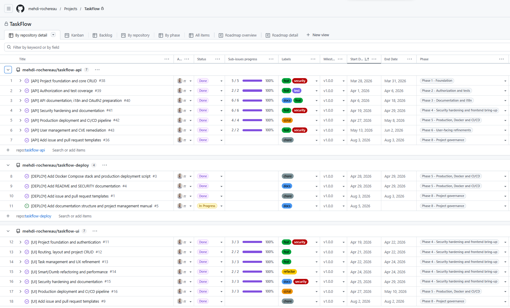
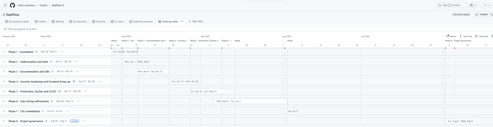
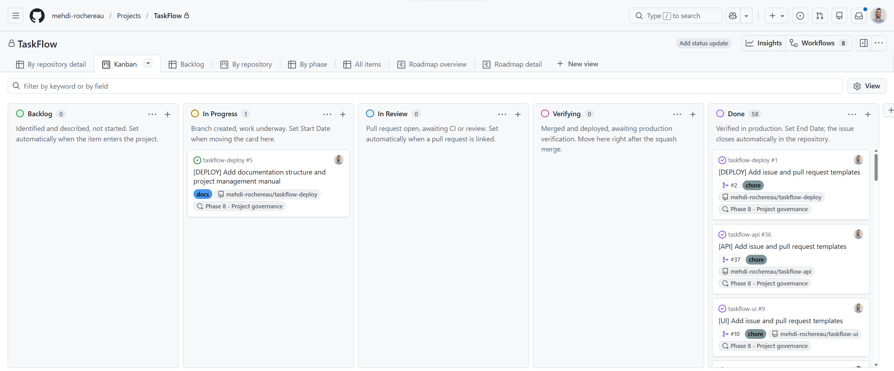

# TaskFlow — Project Documentation

Cross-repository documentation for the TaskFlow portfolio, covering project
framing, management, design and delivery. It applies to the three repositories:
[taskflow-api](https://github.com/mehdi-rochereau/taskflow-api),
[taskflow-ui](https://github.com/mehdi-rochereau/taskflow-ui) and
[taskflow-deploy](https://github.com/mehdi-rochereau/taskflow-deploy).

Work is tracked in the [TaskFlow GitHub Project](https://github.com/users/mehdi-rochereau/projects/4).

## Structure

The layout follows the French CDA competency framework (Concepteur développeur
d'applications, TP-01281). Sections are added through dedicated issues; only the
sections listed with content below exist at this stage.

| Section | Competency | Status |
|---------|------------|--------|
| `01-expression-des-besoins/` — [framing, objectives, scope, stakeholders, requirement prioritisation](01-expression-des-besoins/EXPRESSION_DES_BESOINS.md) | CP5 | **Published** |
| `02-gestion-de-projet/` — project management manual, planning, quality | CP4 | **Published** |
| `03-conception/` — architecture, mockups, UML, data model | CP5, CP6, CP7 | Planned |
| `04-securite/` — security strategy per layer, DICP, watch, [credential rotation](04-securite/DATABASE_CREDENTIAL_ROTATION.md) | Transverse | In progress |
| `05-tests/` — test plan, test data sets | CP9 | Planned |
| `06-deploiement/` — deployment procedure, environments, CI/CD | CP10, CP11 | Planned |
| `images/` — screenshots and diagrams | — | **Published** |

## Project management at a glance

Three repositories, one GitHub Project:

Eight work phases from March to August 2026, including two documented breaks:

The five-status workflow, with automated transitions:

Full conventions, workflow details and reproduction guide:
[`02-gestion-de-projet/PROJECT_MANAGEMENT.md`](02-gestion-de-projet/PROJECT_MANAGEMENT.md) (in French).
